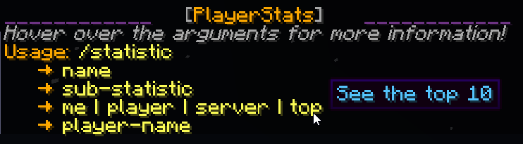

# Development Branch – NOT for Production

This repository represents a personal, in-progress development branch. Features here are experimental and may be untested or unstable. Do not use this build on production servers.

Use the stable release from Spigot or the main branch on GitHub:

- Stable builds: [Spigot Resource](https://www.spigotmc.org/resources/playerstats.102347/)
- Main branch: [GitHub Main](https://github.com/itHotL/PlayerStats/tree/main)

---

<!-- markdownlint-disable MD033 -->
<p align="center">
   
</p>
<!-- markdownlint-enable MD033 -->

## About

PlayerStats is a Minecraft server plugin that adds a command to view player statistics in top-10 format or individually. Currently tested on all versions between **1.16.5** and **1.21.8** on platforms:

## Troubleshooting Legacy Worlds

If your server was created on an older Minecraft version (pre-1.13), player statistic files in `./world/stats/*.json` may contain legacy entity names like "EntityHorse" instead of "minecraft:horse". This causes parse errors on startup/shutdown:

```
[ERROR] Failed to parse statistics for ./world/stats/UUID.json: Not a valid resource location: EntityHorse
```

These errors are from vanilla Minecraft and do not affect gameplay, but they spam logs and may cause incomplete stats (e.g., 0 for entity kills). PlayerStats relies on Bukkit's API, which returns defaults for unparsable data, leading to "Failed to generate top list" warnings.

### Fixes:
1. **Ignore if minor**: Errors are harmless; stats for affected entities will be 0.
2. **Convert stats files**: Use tools like [MCA Selector](https://github.com/elmomwe/mcaselector) or [NBTExplorer](https://github.com/jaquadro/NBTExplorer) to edit JSON files. Map old names:
   - "EntityHorse" → "minecraft:horse"
   - "EntityCow" → "minecraft:cow"
   - See [Minecraft Wiki: Entity IDs](https://minecraft.wiki/w/Java_Edition_data_values/Pre-flattening/Entity_IDs) for full mappings.
3. **Regenerate stats**: If feasible, reset player stats files (backup first!).
4. **Update server**: Ensure using latest Paper/Spigot for better legacy handling.

PlayerStats v2.5+ handles shutdown gracefully to avoid hanging tasks during these errors.

- Bukkit
- Spigot
- Paper
- Purpur

(It's possible PlayerStats works on other platforms too, but these are the ones I have explicitly tested.)

## Database Integration (MongoDB & PostgreSQL)

PlayerStats can optionally sync per-player statistics and precomputed top lists to a database. This enables fast leaderboards across restarts and external analytics.

- Supported providers: `postgres` (default) and `mongo`.
- Database writes are executed asynchronously with backpressure to protect the server thread.
- You can restrict which statistic keys are written via `database.tracked-stats`.
- Providers create helpful indexes automatically on startup for reliable performance.

### Enabling the Database

Configure the `database` section in `src/main/resources/config.yml`:

```yaml
database:
  enabled: true
  type: "postgres" # or "mongo"
  generate-top-on-load: true
  generate-top-periodically: false
  generate-top-interval-minutes: 15
  update-player-on-join: true
  top-list-size: 10
  tracked-stats: [] # empty = track all, or list specific keys (see below)

  # Async + write deduplication
  async-threads: 2
  player-update-min-interval-ms: 10000
  top-upsert-min-interval-ms: 60000

  # Verbose provider logging
  verbose-logging: false

  # Mongo
  mongo:
    uri: "mongodb://localhost:27017"
    database: "playerstats"
    collection-player: "player_stats"
    collection-top: "top_stats"

  # PostgreSQL
  postgres:
    host: "localhost"
    port: 5432
    database: "playerstats"
    user: "postgres"
    password: ""
    schema: "public"
    ssl: false
    table-player: "player_stats"
    table-top: "top_stats"

  # Connection pool
  pool:
    max-pool-size: 5
    connection-timeout-ms: 10000
```

### Tracked stats key format

Set `database.tracked-stats` to limit which stats are persisted. If empty or omitted, the plugin will auto-detect and track all stat keys.

- UNTYPED: `UNTYPED:STATISTIC`
- ITEM: `ITEM:STATISTIC:MATERIAL`
- BLOCK: `BLOCK:STATISTIC:MATERIAL`
- ENTITY: `ENTITY:STATISTIC:ENTITY_TYPE`

Examples:

```yaml
database:
  tracked-stats:
    - "UNTYPED:LEAVE_GAME"
    - "ITEM:USE_ITEM:DIAMOND_SWORD"
    - "BLOCK:MINE_BLOCK:STONE"
    - "ENTITY:KILL_ENTITY:ZOMBIE"
```

Invalid or unknown entries are ignored with a warning in the console. Keys are validated and capped to a safe length.

### Supported Statistics

PlayerStats supports logging all player statistics defined in the [Bukkit `Statistic` enum](https://hub.spigotmc.org/javadocs/spigot/org/bukkit/Statistic.html) (tested up to Minecraft 1.21). These are the base actions tracked by the game, categorized by `Statistic.Type`.

- **Logging Behavior**: If `tracked-stats` is empty (`[]`), the plugin auto-detects and logs all valid stat keys encountered during gameplay (e.g., on player join or periodic updates). Otherwise, only explicitly listed keys are persisted to the database. Updates occur asynchronously via a thread pool (default: 2 threads) with minimum intervals to deduplicate writes (player stats: 10s, top lists: 60s). Negative or invalid values are clamped to 0.

- **Key Generation**: Keys follow the format `TYPE:STATISTIC[:QUALIFIER]`, where:
  - TYPE: UNTYPED, ITEM, BLOCK, or ENTITY
  - STATISTIC: Base enum value (e.g., PLAY_ONE_MINUTE)
  - QUALIFIER: Material name for ITEM/BLOCK, EntityType name for ENTITY (upper case, no spaces)

The full set of possible keys is extensive (thousands, due to ~800 Materials and ~100 EntityTypes), but only valid combinations per the Bukkit API are supported. Below is the complete list of base statistics grouped by type, with examples. For exhaustive qualifiers, see [Material](https://hub.spigotmc.org/javadocs/spigot/org/bukkit/Material.html) and [EntityType](https://hub.spigotmc.org/javadocs/spigot/org/bukkit/entity/EntityType.html).

#### UNTYPED Statistics
No qualifier needed. Key: `UNTYPED:STATISTIC`

These track general gameplay events like time played, deaths, interactions, etc.

- ANVIL_ONE_USE
- ARMOR_CLEANED
- BANNER_CLEANED
- BEACON_INTERACTION
- BOWL_EMPTY
- BOWL_SWEET_BERRIES
- BOWL_SUSPICIOUS_STEW
- BREWINGSTAND_INTERACTION
- CAKE_SLICES_EATEN
- CLEAN_ARMOR
- CLEAN_BANNER
- CLEAN_SHULKER_BOX
- CLIMB_ONE_CM
- CROP_PLANTED
- DAMAGE_ABSORBED
- DAMAGE_BLOCKED_BY_SHIELD
- DAMAGE_DEALT
- DAMAGE_DEALT_ABSORBED
- DAMAGE_DEALT_RESISTED
- DAMAGE_RESISTED
- DAMAGE_TAKEN
- DEATHS
- DROP
- ENCHANT_ITEM
- ENCHANTED_ITEM_REPAIRED
- FILL_CAULDRON
- FIREWORK_LAUNCHED
- FLY_ONE_CM
- FURNACE_INTERACTION
- HOPPER_INTERACTION
- INTERACT_WITH_ANVIL
- INTERACT_WITH_BLAST_FURNACE
- INTERACT_WITH_BREWINGSTAND
- INTERACT_WITH_CAMPFIRE
- INTERACT_WITH_CARTOGRAPHY_TABLE
- INTERACT_WITH_CRAFTING_TABLE
- INTERACT_WITH_GRINDSTONE
- INTERACT_WITH_LECTERN
- INTERACT_WITH_LOOM
- INTERACT_WITH_SMITHING_TABLE
- INTERACT_WITH_SMOKER
- INTERACT_WITH_STONECUTTER
- JUMP
- LEAVE_GAME
- LEVER_INTERACT
- LIGHT_BLOCK
- LIGHT_INTERACT
- LINGERING_POTION_PICKED_UP
- MOB_KILLS
- NOTE_BLOCK_INTERACT
- NOTE_BLOCK_PLAYED
- NOTE_BLOCK_TUNED
- OPEN_BARREL
- OPEN_CHEST
- OPEN_ENDERCHEST
- OPEN_SHULKERBOX
- OPEN_TRAPPED_CHEST
- PAINTING_INTERACT
- PICKUP
- PLAY_NOTEBLOCK
- PLAY_RECORD
- POTION_BREWED
- PUMPKIN_PIECES_EATEN
- RIDE_HORSE_ONE_CM
- RIDE_PIG_ONE_CM
- RIDE_STRIDER_ONE_CM
- SKELETON_KILLED
- SLIME_KILLED
- SLEEP_IN_BED
- SLIME_SPLIT
- SMELT_IRON
- SMELT_SAND
- SMITHING_TABLE_INTERACTION
- SNIFFER_EGG_HATCHED
- SNIFFER_EGG_PLACED
- SNIFFER_NEST_INTERACTED
- SNIFFER_SEED_PLANTED
- SPECTATOR
- SPIDER_KILLED
- SPLASH_POTION
- SPRINT_ONE_CM
- STEALTH_ONE_CM
- SWIM_ONE_CM
- TALKED_TO_VILLAGER
- TARGET_HIT
- TARGET_MISSED
- TIME_SINCE_DEATH
- TIME_SINCE_REST
- TOTEM_ACTIVATED
- TRADE
- TRADE_WITH_VILLAGER
- TRAPDOOR_INTERACT
- TRAPPED_CHEST_INTERACT
- TRIGGER_TRAPPED_CHEST
- TRIM_ARMOR_WITH_SMITH
- TRIMMED_ARMOR
- TRIPWIRE_INTERACT
- TRIPWIRE_TRIGGERED
- TUNE_NOTEBLOCK
- TURN_TABLE_INTERACT
- WALK_ONE_CM
- WALK_ON_WATER_ONE_CM
- WATER_BUCKET_PLACED
- WOLF_KILLED
- ZOMBIE_KILLED
- ZOMBIE_VILLAGER_KILLED

#### ITEM Statistics
Qualifier: Item Material (e.g., DIAMOND_SWORD, BOW). Key: `ITEM:STATISTIC:MATERIAL`

Base statistics:
- BREAK_ITEM
- CRAFT_ITEM
- DROP
- PICKUP
- USE_ITEM

Example: `ITEM:USE_ITEM:DIAMOND_SWORD` (times used diamond sword)

#### BLOCK Statistics
Qualifier: Block Material (e.g., STONE, OAK_PLANKS). Key: `BLOCK:STATISTIC:MATERIAL`

Base statistics:
- CRAFT_BLOCK
- MINE_BLOCK
- PLACE_BLOCK

Example: `BLOCK:MINE_BLOCK:STONE` (blocks of stone mined)

#### ENTITY Statistics
Qualifier: Living EntityType (e.g., ZOMBIE, CREEPER). Key: `ENTITY:STATISTIC:ENTITY_TYPE`

Base statistics:
- DAMAGE_DEALT
- KILL_ENTITY

Example: `ENTITY:KILL_ENTITY:ZOMBIE` (zombies killed)

For the complete and up-to-date list, consult the Bukkit API documentation, as new statistics may be added in future Minecraft versions. The plugin validates keys at runtime and ignores invalid ones.

### Indexes created automatically

- MongoDB
  - `player_stats`: unique index on `uuid`
  - `top_stats`: unique index on `statKey`

- PostgreSQL
  - `player_stats`: primary key on `uuid`, index on `updated_at`, and a GIN index on `stats` (`jsonb_path_ops`) for future JSONB queries.
  - `top_stats`: primary key on `stat_key`, index on `updated_at`.

These indexes are created idempotently during provider startup.

### Database Schema

The plugin creates two main structures: one for per-player statistics and one for precomputed top lists. Updates are performed asynchronously to avoid blocking the server thread. Only non-negative integer values are stored, and player names are sanitized (control chars removed, trimmed to 32 chars max).

#### MongoDB Collections

**player_stats** (default collection: `player_stats`)

- `uuid`: string - Unique player UUID (required, unique index for upserts)
- `name`: string - Current player name (updated on each stat write)
- `updatedAt`: long - Unix timestamp in milliseconds of last update
- `stats`: object - Nested map of stat keys to values, e.g.:
  ```
  {
    "UNTYPED:PLAY_ONE_MINUTE": 3600,
    "BLOCK:MINE_BLOCK:STONE": 150,
    "ENTITY:KILL_ENTITY:ZOMBIE": 42
  }
  ```

**top_stats** (default collection: `top_stats`)

- `statKey`: string - The tracked statistic key (required, unique index)
- `topSize`: int - Number of top entries (e.g., 10)
- `updatedAt`: long - Unix timestamp of last top list computation
- `entries`: array - Ordered list of top players (descending value), limited to `topSize`, e.g.:
  ```
  [
    { "name": "Player1", "value": 1000 },
    { "name": "Player2", "value": 900 },
    ...
  ]
  ```

#### PostgreSQL Tables

Tables are created in the specified schema (default: `public`). Uses JSONB for efficient storage and querying of stats.

**player_stats** (default table: `player_stats`)

- `uuid`: UUID PRIMARY KEY - Unique player UUID
- `name`: TEXT NOT NULL - Player name
- `updated_at`: BIGINT NOT NULL - Unix timestamp in milliseconds
- `stats`: JSONB NOT NULL DEFAULT '{}'::jsonb - Stats map (merged on upsert), e.g.:
  ```
  {
    "UNTYPED:LEAVE_GAME": 5,
    "ITEM:USE_ITEM:BOW": 200
  }
  ```

Additional indexes:
- `idx_player_stats_updated_at`: B-tree index on `updated_at` for time-based queries
- `idx_player_stats_stats_gin`: GIN index on `stats` using `jsonb_path_ops` for fast lookups by stat key (e.g., query players with specific stat > value)

**top_stats** (default table: `top_stats`)

- `stat_key`: TEXT PRIMARY KEY - Statistic key
- `top_size`: INT NOT NULL - Top list size
- `updated_at`: BIGINT NOT NULL - Timestamp
- `entries`: JSONB NOT NULL - Array of top entries, e.g.:
  ```
  [
    { "name": "Player1", "value": 1000 },
    { "name": "Player2", "value": 900 }
  ]
  ```

Additional index:
- `idx_top_stats_updated_at`: B-tree index on `updated_at`

Schema creation is idempotent (IF NOT EXISTS). For production, ensure proper permissions and backups. Example query for top diamond miners (Postgres):
```sql
SELECT e->>'name' AS player, (e->>'value')::int AS count
FROM top_stats, jsonb_array_elements(entries) AS e
WHERE stat_key = 'BLOCK:MINE_BLOCK:DIAMOND_ORE'
ORDER BY count DESC;
```

### Periodic top generation

If you want the plugin to periodically re-generate and store all configured top lists to the database, enable the scheduler:

```yaml
database:
  enabled: true
  generate-top-periodically: true
  generate-top-interval-minutes: 15 # run every 15 minutes (min 1)
```

- When `database.generate-top-on-load` is true, a one-time generation runs during plugin startup (if the database is enabled).
- The periodic task runs asynchronously and only when the database remains enabled.
- Top list writes are deduplicated using `database.top-upsert-min-interval-ms` and a content hash to avoid unnecessary writes.

#### Filtering Old Players (Avoid Legacy Stat Errors)

To reduce log spam from legacy world stats (e.g., "EntityHorse" parse errors), limit to recent players:

- **Relative Days**: Set `number-of-days-since-last-joined` (global, under General) to e.g., 365 for last year.
- **Absolute Date**: Set `since-absolute-date` (under Database) to "2024-01-01" for players joined since then. Overrides days if set.

Example:
```
database:
  since-absolute-date: "2024-01-01"  # Only players since Jan 1, 2024

# Or use relative (global):
number-of-days-since-last-joined: 365  # Last year
```

This filters during player loading, avoiding old JSON files. Combine with README's legacy troubleshooting for full resolution.

### Connection pooling and performance

- PostgreSQL uses HikariCP. You can tune:
  - `database.pool.max-pool-size`
  - `database.pool.connection-timeout-ms`
  - The plugin sets a small `minimumIdle` and a 5-minute keepalive internally.
  - When `database.verbose-logging` is true, leak detection and validation timeouts are enabled to help diagnose issues.

- Asynchronous writes use a bounded queue. When the queue fills, writes fall back to the calling thread (backpressure) to avoid unbounded memory growth.

### Security recommendations

- Use strong credentials; prefer environment variables or a secrets manager for passwords.
- For remote PostgreSQL connections, enable `ssl: true`.
- For MongoDB over the network, include credentials and enable TLS in your URI (e.g., `mongodb+srv://` or `?tls=true`).

## Configuration Reference

PlayerStats configuration is handled via `config.yml`. Below is a complete reference of all options, grouped by section. Defaults are shown; customize as needed. Reload with `/stat reload` (requires `playerstats.reload` permission).

### General Settings

These control core behavior, permissions, and player filtering.

```yaml
# Debug logging level (1=low errors only, 2=medium tasks/timings, 3=high all details)
debug-level: 1

# Prevent players from spamming stat requests (true=one at a time per player)
only-allow-one-lookup-at-a-time-per-player: true

# Enable sharing stats in chat
enable-stat-sharing: true

# Cooldown (minutes) before sharing again (0=disabled)
waiting-time-before-sharing-again: 0

# Include only whitelisted players in stats
include-whitelist-only: false

# Exclude banned players from stats
exclude-banned-players: false

# Days since last join to include players (0=all players)
number-of-days-since-last-joined: 0

# Absolute date (YYYY-MM-DD) to include only players joined since then (overrides days; empty=use days)
since-absolute-date: ""

# Allow viewing excluded players' individual stats via /stat player (true=allowed)
allow-player-lookups-for-excluded-players: true
```

### Format & Display

Controls output formatting, hover text, themes, and layout.

```yaml
# Translate stat names to client's language (uses Minecraft's built-in translations)
translate-to-client-language: true

# Show additional info in hover text
enable-hover-text: true

# Auto-apply holiday/festival themes (e.g., Halloween, Pride)
enable-festive-formatting: true

# Always use rainbow colors
rainbow-mode: false

# Add empty line before stat results in chat
use-enters:
  top-stats: true          # Before top lists
  top-stats-shared: false  # Before shared top lists
  player-stats: false      # Before player stats
  player-stats-shared: false  # Before shared player stats
  server-stats: false      # Before server totals
  server-stats-shared: false  # Before shared server totals

# Align top list numbers with dots (...)
use-dots: true

# Max entries in top lists
top-list-max-size: 10

# Title prefix for top lists (e.g., "Top 10 Animals Bred")
top-list-title: 'Top'

# Title prefix for server totals (e.g., "Total on This Server: X Animals Bred")
total-server-stat-title: 'Total on'
your-server-name: 'this server'
```

### Units

Customizes display for distance, damage, and time stats. Minecraft uses cm (distance), half-hearts (damage), and ticks (time).

#### Distance & Damage
```yaml
# Distance unit: blocks, cm, m (blocks), miles, km
distance-unit: blocks
distance-unit-for-hover-text: km

# Damage unit: hp, hearts
damage-unit: hearts
damage-unit-for-hover-text: hp
```

#### Time
```yaml
# Auto-detect largest suitable time unit (weeks/days/hours/minutes/seconds/ticks)
auto-detect-biggest-time-unit: true
# Additional smaller units to show (e.g., 1=show days + hours for "9D 5H")
number-of-extra-units: 1

# Same for hover text
auto-detect-biggest-time-unit-for-hover-text: false
number-of-extra-units-for-hover-text: 0

# Manual time units (if auto-detect=false): days, hours, minutes, seconds, ticks
biggest-time-unit: days
smallest-time-unit: hours
biggest-time-unit-for-hover-text: hours
smallest-time-unit-for-hover-text: seconds
```

### Color & Style

Defines colors (chat colors or hex #RRGGBB) and styles (bold, italic, etc.) for output elements. See config comments for valid values.

```yaml
# How much lighter (%) to make hover text vs. main text
hover-text-amount-lighter: 40

# Shared stats (e.g., "Shared by Player")
shared-stats:
  shared-by: gray
  shared-by-style: italic
  player-name: "#EE8A19"  # Hex example
  player-name-style: italic

# Top lists
top-list:
  title: '#FFD52B'        # e.g., "Top 10"
  title-style: none
  title-number: gold      # e.g., "10"
  title-number-style: none
  stat-names: '#FFD52B'   # e.g., "Animals Bred"
  stat-names-style: none
  sub-stat-names: yellow  # e.g., "(Cow)"
  sub-stat-names-style: none
  rank-numbers: gold      # e.g., "1."
  rank-numbers-style: none
  player-names: green     # e.g., "Player1:"
  player-names-style: none
  stat-numbers: '#55AAFF' # e.g., "150"
  stat-numbers-style: none
  dots: dark_gray         # Alignment dots
  dots-style: none

# Individual player stats
individual-statistics:
  player-names: gold      # e.g., "Player1:"
  player-names-style: none
  stat-names: '#FFD52B'   # e.g., "Animals Bred"
  stat-names-style: none
  sub-stat-names: yellow  # e.g., "(Cow)"
  sub-stat-names-style: none
  stat-numbers: '#ADE7FF' # e.g., "150"
  stat-numbers-style: none

# Server totals
total-server:
  title: '#55AAFF'        # e.g., "Total on This Server"
  title-style: none
  server-name: '#55AAFF'  # e.g., "This Server"
  server-name-style: none
  stat-names: '#FFD52B'   # e.g., "Animals Bred"
  stat-names-style: none
  sub-stat-names: yellow  # e.g., "(Cow)"
  sub-stat-names-style: none
  stat-numbers: '#ADE7FF' # e.g., "1500"
  stat-numbers-style: none
```

### Database Settings

See the [Database Integration](#database-integration-mongodb--postgresql) section above for detailed usage. All options:

```yaml
# Enable database syncing
database:
  enabled: false
  type: "postgres"  # mongo or postgres

  # Generate top lists on plugin load
  generate-top-on-load: true

  # Auto-regenerate top lists periodically
  generate-top-periodically: false
  generate-top-interval-minutes: 15  # >=1 minute

  # Update player stats on join
  update-player-on-join: true

  # Top list size for DB generation
  top-list-size: 10

  # Date filter for players (YYYY-MM-DD; overrides global days)
  since-absolute-date: ""

  # Stats to track (empty=all auto-detected). Format: TYPE:STATISTIC[:QUALIFIER]
  tracked-stats: []  # See examples in config

  # Async write tuning
  async-threads: 2  # Worker threads (>=1)
  player-update-min-interval-ms: 10000  # Dedupe player writes (ms)
  top-upsert-min-interval-ms: 60000     # Dedupe top list writes (ms)

  # Extra logging (queue/writes/init)
  verbose-logging: false

  # MongoDB
  mongo:
    uri: "mongodb://localhost:27017"  # Full connection string
    database: "playerstats"
    collection-player: "player_stats"
    collection-top: "top_stats"

  # PostgreSQL
  postgres:
    host: "localhost"
    port: 5432
    database: "playerstats"
    user: "postgres"
    password: ""  # Use env vars for production
    schema: "public"
    ssl: false  # Enable for remote
    table-player: "player_stats"
    table-top: "top_stats"

  # Shared connection pool (HikariCP for Postgres)
  pool:
    max-pool-size: 5
    connection-timeout-ms: 10000
```

For `tracked-stats` examples and key formats, refer to the database section above. Invalid keys are ignored with warnings.

## Features

### Easy to use

- One central command that can:
  - Explain **how to use** the plugin with `/statistic`
    
  - Show you the **top 10** on your server for all possible statistics with `/statistic ... top`
    
  - See those same statistics for any **individual player** with `/statistic ... player`
    
  - Or look up the **combined total** of everyone on your server
    
  - Guide you through the available options while you type with an extensive **tab-complete** feature
    
  - See the output in a **readable format** that makes sense in the Minecraft world, with more information in hover-text:
    
  - **Share statistics** that you look up with the other players in chat:
    

### No set-up required

- PlayerStats will work correctly regardless of how long your server has already existed - it doesn't
  have to be present when you start a new world
- Data is retrieved directly from already existing playerfiles, so you don't have to
  set up a database, use scoreboards, or anything of the sort

### PlaceholderAPI support

- Placeholders are added in a separate expansion, which can be found on [GitHub](https://github.com/Artemis-the-gr8/PlayerStatsExpansion), in the PlaceholderAPI [eCloud](https://api.extendedclip.com/expansions/playerstatsexpansion/), or downloaded in-game with `/papi ecloud download PlayerStats`
- For more information about the placeholders, see the expansion's [GitHub page](https://github.com/Artemis-the-gr8/PlayerStatsExpansion).

### Safe

- PlayerStats uses **multi-threading** to ensure server performance does not suffer and
  players cannot crash the server by spamming its commands.
- This also means that calculating statistics will be very **fast**.

### Customizable

- You can customize the following (and more):
  - Choose which **range of units** you want to display your time-, damage- and distance-based statistics in:
    
  - **Automatically translate** statistics to the language of the client that views them, or customize the statistic-names through the **language.yml** file
  - Use festive formatting, or enable rainbow mode whenever!
    
  - Only show statistics for **whitelisted** players
  - Exclude statistics from **banned** players
  - Exclude statistics from specific players with `/statexclude`
  - Limit who is allowed to **share statistics** in chat and how often players can share
  - Limit statistics based on when a player **last joined**.
    This option can be particularly useful if you have had a lot of players join your server in the past
    whose statistics aren't of particular interest to your current player-base.
    On top of that, limiting the amount of players shown in the top 10 can greatly increase performance speed.
  - The **colors** you want the output to be
  - You can go for default Minecraft chat colors, or use **hex colors**!
  - Whether you want the output to have additional **style**, such as italics

- You can configure the following **permissions**:
  - `playerstats.stat` for using the general command (true for everyone by default)
  - `playerstats.share` for sharing statistics in chat (true for everyone by default)
  - `playerstats.reload` for reloading the config (only for OP players by default)
  - `playerstats.exclude` to exclude players from top- and server-statistics (only for OP players by default)

## API Usage

To import the PlayerStats API with Maven, add the following dependency and repository to your POM.xml:

```xml
<repositories>
    <repository>
        <id>sonatype-oss-snapshots1</id> <!-- the OSSRH repository for snapshots -->
        <url>https://s01.oss.sonatype.org/content/repositories/snapshots/</url>
     </repository>
</repositories>

<dependencies>
    <dependency>
        <groupId>io.github.ithotl</groupId>
        <artifactId>PlayerStats</artifactId>
        <version>2.0-SNAPSHOT</version>
        <scope>provided</scope>
    </dependency>
</dependencies>
```

You can download the sources and Javadocs through your code editor, or visit the [PlayerStats API Javadocs](https://s01.oss.sonatype.org/service/local/repositories/snapshots/archive/io/github/ithotl/PlayerStats/2.0-SNAPSHOT/PlayerStats-2.0-20230228.110241-1-javadoc.jar/!/com/artemis/the/gr8/playerstats/api/PlayerStats.html).
To get an instance of the API, you can do the following:

```java
PlayerStats playerStats = PlayerStats.getAPI();
```

## Author Info

I am a relatively new programmer, and this is one of my first projects. I greatly enjoyed making it,
and I tried to make it as efficient as I could. If you have any questions, remarks, or suggestions,
please let me know! You can find me on [Artemis-the-gr8 on GitHub](https://github.com/Artemis-the-gr8).

## Licence

PlayerStats is licenced under the MIT licence. Please see [LICENCE](LICENSE) for more information.
