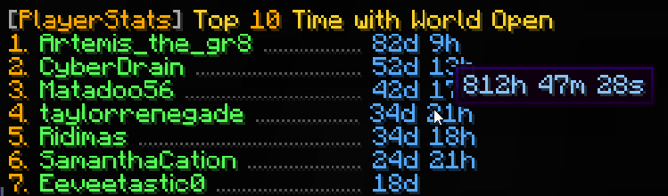
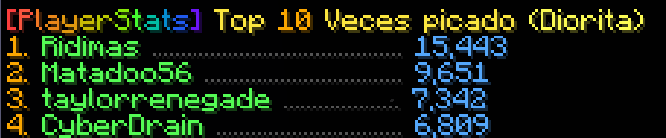

# Development Branch – NOT for Production

This repository represents a personal, in-progress development branch. Features here are experimental and may be untested or unstable. Do not use this build on production servers.

Use the stable release from Spigot or the main branch on GitHub:

- Stable builds: [Spigot Resource](https://www.spigotmc.org/resources/playerstats.102347/)
- Main branch: [GitHub Main](https://github.com/itHotL/PlayerStats/tree/main)

---

<!-- markdownlint-disable MD033 -->
<p align="center">
   
</p>
<!-- markdownlint-enable MD033 -->

## About

PlayerStats is a Minecraft server plugin that adds a command to view player statistics in top-10 format or individually. Currently tested on all versions between **1.16.5** and **1.21.8** on platforms:

- Bukkit
- Spigot
- Paper
- Purpur

(It's possible PlayerStats works on other platforms too, but these are the ones I have explicitly tested.)

## Database Integration (MongoDB & PostgreSQL)

PlayerStats can optionally sync per-player statistics and precomputed top lists to a database. This enables fast leaderboards across restarts and external analytics.

- Supported providers: `postgres` (default) and `mongo`.
- Database writes are executed asynchronously with backpressure to protect the server thread.
- You can restrict which statistic keys are written via `database.tracked-stats`.
- Providers create helpful indexes automatically on startup for reliable performance.

### Enabling the Database

Configure the `database` section in `src/main/resources/config.yml`:

```yaml
database:
  enabled: true
  type: "postgres" # or "mongo"
  generate-top-on-load: true
  generate-top-periodically: false
  generate-top-interval-minutes: 15
  update-player-on-join: true
  top-list-size: 10
  tracked-stats: [] # empty = track all, or list specific keys (see below)

  # Async + write deduplication
  async-threads: 2
  player-update-min-interval-ms: 10000
  top-upsert-min-interval-ms: 60000

  # Verbose provider logging
  verbose-logging: false

  # Mongo
  mongo:
    uri: "mongodb://localhost:27017"
    database: "playerstats"
    collection-player: "player_stats"
    collection-top: "top_stats"

  # PostgreSQL
  postgres:
    host: "localhost"
    port: 5432
    database: "playerstats"
    user: "postgres"
    password: ""
    schema: "public"
    ssl: false
    table-player: "player_stats"
    table-top: "top_stats"

  # Connection pool
  pool:
    max-pool-size: 5
    connection-timeout-ms: 10000
```

### Tracked stats key format

Set `database.tracked-stats` to limit which stats are persisted. If empty or omitted, the plugin will auto-detect and track all stat keys.

- UNTYPED: `UNTYPED:STATISTIC`
- ITEM: `ITEM:STATISTIC:MATERIAL`
- BLOCK: `BLOCK:STATISTIC:MATERIAL`
- ENTITY: `ENTITY:STATISTIC:ENTITY_TYPE`

Examples:

```yaml
database:
  tracked-stats:
    - "UNTYPED:LEAVE_GAME"
    - "ITEM:USE_ITEM:DIAMOND_SWORD"
    - "BLOCK:MINE_BLOCK:STONE"
    - "ENTITY:KILL_ENTITY:ZOMBIE"
```

Invalid or unknown entries are ignored with a warning in the console. Keys are validated and capped to a safe length.

### Indexes created automatically

- MongoDB
  - `player_stats`: unique index on `uuid`
  - `top_stats`: unique index on `statKey`

- PostgreSQL
  - `player_stats`: primary key on `uuid`, index on `updated_at`, and a GIN index on `stats` (`jsonb_path_ops`) for future JSONB queries.
  - `top_stats`: primary key on `stat_key`, index on `updated_at`.

These indexes are created idempotently during provider startup.

### Periodic top generation

If you want the plugin to periodically re-generate and persist all configured top lists to the database, enable the scheduler:

```yaml
database:
  enabled: true
  generate-top-periodically: true
  generate-top-interval-minutes: 15 # run every 15 minutes (min 1)
```

- When `database.generate-top-on-load` is true, a one-time generation runs during plugin startup (if the database is enabled).
- The periodic task runs asynchronously and only when the database remains enabled.
- Top list writes are deduplicated using `database.top-upsert-min-interval-ms` and a content hash to avoid unnecessary writes.

### Connection pooling and performance

- PostgreSQL uses HikariCP. You can tune:
  - `database.pool.max-pool-size`
  - `database.pool.connection-timeout-ms`
  - The plugin sets a small `minimumIdle` and a 5-minute keepalive internally.
  - When `database.verbose-logging` is true, leak detection and validation timeouts are enabled to help diagnose issues.

- Asynchronous writes use a bounded queue. When the queue fills, writes fall back to the calling thread (backpressure) to avoid unbounded memory growth.

### Security recommendations

- Use strong credentials; prefer environment variables or a secrets manager for passwords.
- For remote PostgreSQL connections, enable `ssl: true`.
- For MongoDB over the network, include credentials and enable TLS in your URI (e.g., `mongodb+srv://` or `?tls=true`).

## Features

### Easy to use

- One central command that can:
  - Explain **how to use** the plugin with `/statistic`
    
  - Show you the **top 10** on your server for all possible statistics with `/statistic ... top`
    
  - See those same statistics for any **individual player** with `/statistic ... player`
    
  - Or look up the **combined total** of everyone on your server
    
  - Guide you through the available options while you type with an extensive **tab-complete** feature
    
  - See the output in a **readable format** that makes sense in the Minecraft world, with more information in hover-text:
    
  - **Share statistics** that you look up with the other players in chat:
    

### No set-up required

- PlayerStats will work correctly regardless of how long your server has already existed - it doesn't
  have to be present when you start a new world
- Data is retrieved directly from already existing playerfiles, so you don't have to
  set up a database, use scoreboards, or anything of the sort

### PlaceholderAPI support

- Placeholders are added in a separate expansion, which can be found on [GitHub](https://github.com/Artemis-the-gr8/PlayerStatsExpansion), in the PlaceholderAPI [eCloud](https://api.extendedclip.com/expansions/playerstatsexpansion/), or downloaded in-game with `/papi ecloud download PlayerStats`
- For more information about the placeholders, see the expansion's [GitHub page](https://github.com/Artemis-the-gr8/PlayerStatsExpansion).

### Safe

- PlayerStats uses **multi-threading** to ensure server performance does not suffer and
  players cannot crash the server by spamming its commands.
- This also means that calculating statistics will be very **fast**.

### Customizable

- You can customize the following (and more):
  - Choose which **range of units** you want to display your time-, damage- and distance-based statistics in:
    
  - **Automatically translate** statistics to the language of the client that views them, or customize the statistic-names through the **language.yml** file
  - Use festive formatting, or enable rainbow mode whenever!
    
  - Only show statistics for **whitelisted** players
  - Exclude statistics from **banned** players
  - Exclude statistics from specific players with `/statexclude`
  - Limit who is allowed to **share statistics** in chat and how often players can share
  - Limit statistics based on when a player **last joined**.
    This option can be particularly useful if you have had a lot of players join your server in the past
    whose statistics aren't of particular interest to your current player-base.
    On top of that, limiting the amount of players shown in the top 10 can greatly increase performance speed.
  - The **colors** you want the output to be
  - You can go for default Minecraft chat colors, or use **hex colors**!
  - Whether you want the output to have additional **style**, such as italics

- You can configure the following **permissions**:
  - `playerstats.stat` for using the general command (true for everyone by default)
  - `playerstats.share` for sharing statistics in chat (true for everyone by default)
  - `playerstats.reload` for reloading the config (only for OP players by default)
  - `playerstats.exclude` to exclude players from top- and server-statistics (only for OP players by default)

## API Usage

To import the PlayerStats API with Maven, add the following dependency and repository to your POM.xml:

```xml
<repositories>
    <repository>
        <id>sonatype-oss-snapshots1</id> <!-- the OSSRH repository for snapshots -->
        <url>https://s01.oss.sonatype.org/content/repositories/snapshots/</url>
     </repository>
</repositories>

<dependencies>
    <dependency>
        <groupId>io.github.ithotl</groupId>
        <artifactId>PlayerStats</artifactId>
        <version>2.0-SNAPSHOT</version>
        <scope>provided</scope>
    </dependency>
</dependencies>
```

You can download the sources and Javadocs through your code editor, or visit the [PlayerStats API Javadocs](https://s01.oss.sonatype.org/service/local/repositories/snapshots/archive/io/github/ithotl/PlayerStats/2.0-SNAPSHOT/PlayerStats-2.0-20230228.110241-1-javadoc.jar/!/com/artemis/the/gr8/playerstats/api/PlayerStats.html).
To get an instance of the API, you can do the following:

```java
PlayerStats playerStats = PlayerStats.getAPI();
```

## Author Info

I am a relatively new programmer, and this is one of my first projects. I greatly enjoyed making it,
and I tried to make it as efficient as I could. If you have any questions, remarks, or suggestions,
please let me know! You can find me on [Artemis-the-gr8 on GitHub](https://github.com/Artemis-the-gr8).

## Licence

PlayerStats is licenced under the MIT licence. Please see [LICENCE](LICENSE) for more information.
